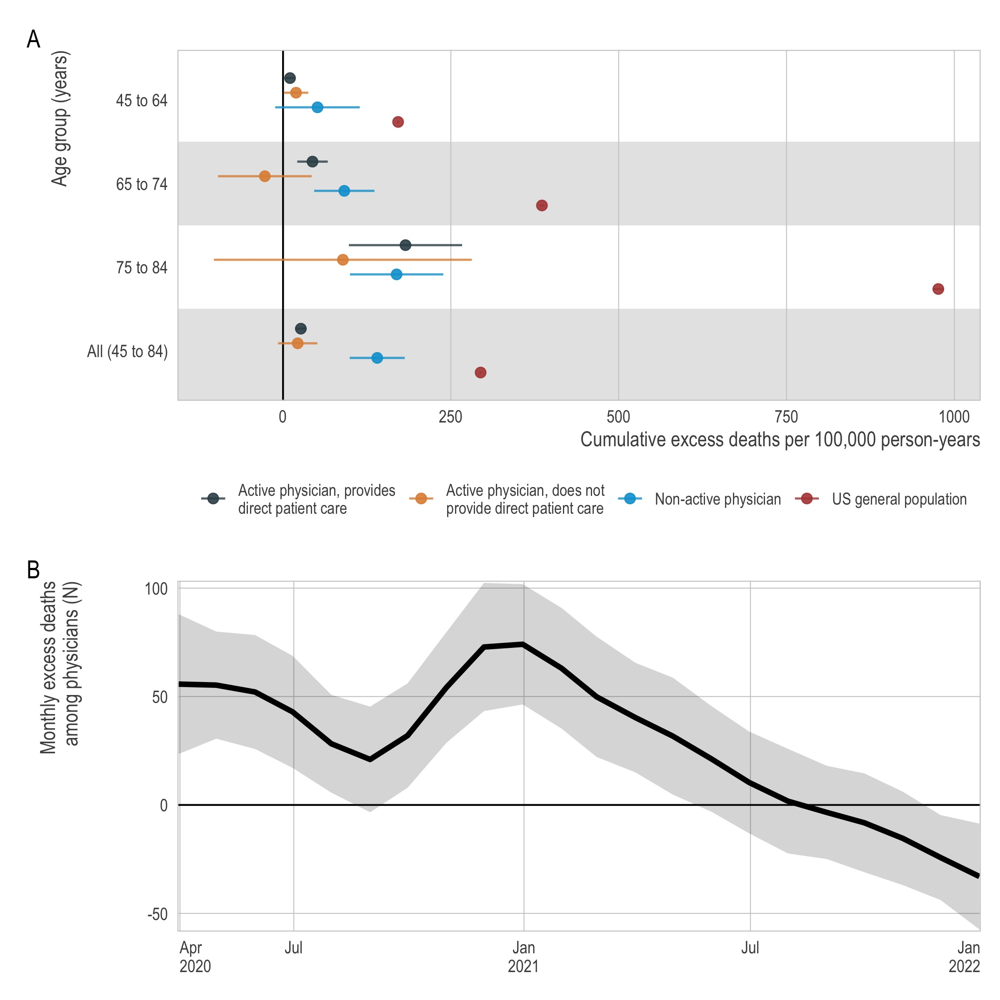

<!-- README.md is generated from README.Rmd. Please edit that file -->

## Excess mortality among US physicians during the COVID-19 pandemic



This repository,
[`excess_physician_mortality`](https://github.com/mkiang/excess_physician_mortality),
contains reproducible code for our open-access *JAMA Internal Medicine*
research letter, [“Excess mortality among US physicians during the
COVID-19 pandemic”](TODO), which uses [data from the American Medical
Association
(AMA)](https://www.ama-assn.org/about/masterfile/ama-physician-masterfile)
to estimate [excess mortality](https://github.com/rafalab/excessmort)
among US physicians during the COVID-19 pandemic. The full citation is:

> Kiang MV, Carlasare LE, Thadaney Israni S, Norcini JJ, Zaman JAB,
> Bibbins-Domingo K. Excess mortality among US physicians during the
> COVID-19 pandemic. *JAMA Internal Medicine*. Published online February
> 6, 2023. <doi:10.1001/jamainternmed.2022.6308>.

## About this repository

All code can be found in the `./code` folder and must be run in order.
The first few lines of each code file contains a brief description of
the tasks related to that file. Numeric representation of our figures
can be found in the `./output` folder. Figures are in the `./plots`
folder. Tables are generated using `rmarkdown` and both source and
output are in the `./rmds` folder. Where applicable, the (shareable) raw
data are in `./data_raw` and the (shareable) processed data are in the
`./data` folder.

## Authors

- [Mathew V Kiang](https://mathewkiang.com)
  (:
  [mkiang](https://github.com/mkiang) \|
  :
  [@mathewkiang](https://twitter.com/mathewkiang))
- Lindsey E Carlasare
- [Sonoo Thadaney Israni](https://profiles.stanford.edu/sonoo)
- John J Norcini
- Junaid AB Zaman
- [Kirsten
  Bibbins-Domingo](https://profiles.ucsf.edu/kirsten.bibbins-domingo)
  (:
  [@KBibbinsDomingo](https://twitter.com/KBibbinsDomingo))

## Conflicts of interest

This study was not directly funded. LEC is employed by the American
Medical Association (AMA). STI serves on the boards of UNICEF
Northwestern Region, SCIENTS, and Society of Bedside Medicine in an
unpaid capacity. KBD is editor-in-chief of *JAMA* and the JAMA Network.
MVK is supported by the National Institutes of Health for work outside
the scope of this manuscript. No individuals received compensation
outside of their usual salaries for their contributions to this work. No
other conflicts to report. See the full manuscript for all
acknowledgements, conflicts, and disclaimers.

The AMA, NIH, and other institutions listed above had no role in the
design and conduct of the study, nor the decision to prepare and submit
the manuscript for publication.

## Notes on Reproducibility

Note, due to limitations in our data use agreement, **we cannot share
physician data** (see online Supplement 2). However, we provide
reproducible code here such that researchers who have access to the [AMA
Masterfile](https://www.ama-assn.org/about/masterfile/ama-physician-masterfile)
and corresponding AMA Deceased Physician File can reproduce and extend
our results.

We use [`renv`](https://rstudio.github.io/renv/index.html) for package
management but below we also post the relevant session information to
ensure full reproducibility.

``` r
> sessioninfo::session_info()
─ Session info ─────────────────────────────────────────────────────────────────
 setting  value
 version  R version 4.2.1 (2022-06-23)
 os       macOS Monterey 12.6.1
 system   x86_64, darwin17.0
 ui       RStudio
 language (EN)
 collate  en_US.UTF-8
 ctype    en_US.UTF-8
 tz       America/Los_Angeles
 date     2022-11-11
 rstudio  2022.07.1+554 Spotted Wakerobin (desktop)
 pandoc   2.18 @ /Applications/RStudio.app/Contents/MacOS/quarto/bin/tools/ (via rmarkdown)

─ Packages ─────────────────────────────────────────────────────────────────────
 ! package        * version  date (UTC) lib source
   anytime          0.3.9    2020-08-27 [1] CRAN (R 4.2.0)
   assertthat       0.2.1    2019-03-21 [1] CRAN (R 4.2.0)
   backports        1.4.1    2021-12-13 [1] CRAN (R 4.2.0)
   broom            1.0.1    2022-08-29 [1] CRAN (R 4.2.0)
   cellranger       1.1.0    2016-07-27 [1] CRAN (R 4.2.0)
   cli              3.4.1    2022-09-23 [1] CRAN (R 4.2.0)
 P codetools        0.2-18   2020-11-04 [?] CRAN (R 4.2.1)
   colorspace       2.0-3    2022-02-21 [1] CRAN (R 4.2.0)
   config         * 0.3.1    2020-12-17 [1] CRAN (R 4.2.0)
   crayon           1.5.2    2022-09-29 [1] CRAN (R 4.2.0)
   curl             4.3.3    2022-10-06 [1] CRAN (R 4.2.0)
   DBI              1.1.3    2022-06-18 [1] CRAN (R 4.2.0)
   dbplyr           2.2.1    2022-06-27 [1] CRAN (R 4.2.0)
   digest           0.6.30   2022-10-18 [1] CRAN (R 4.2.0)
   distributional   0.3.1    2022-09-02 [1] CRAN (R 4.2.0)
   doParallel       1.0.17   2022-02-07 [1] CRAN (R 4.2.0)
   dplyr          * 1.0.10   2022-09-01 [1] CRAN (R 4.2.0)
   ellipsis         0.3.2    2021-04-29 [1] CRAN (R 4.2.0)
   evaluate         0.18     2022-11-07 [1] CRAN (R 4.2.0)
   excessmort     * 0.6.3    2022-11-11 [1] Github (rafalab/excessmort@571a5b7)
   fable          * 0.3.2    2022-09-01 [1] CRAN (R 4.2.0)
   fabletools     * 0.3.2    2021-11-29 [1] CRAN (R 4.2.0)
   fansi            1.0.3    2022-03-24 [1] CRAN (R 4.2.0)
   farver           2.1.1    2022-07-06 [1] CRAN (R 4.2.0)
   fastmap          1.1.0    2021-01-25 [1] CRAN (R 4.2.0)
   feasts         * 0.3.0    2022-09-01 [1] CRAN (R 4.2.0)
   forcats        * 0.5.2    2022-08-19 [1] CRAN (R 4.2.0)
   foreach          1.5.2    2022-02-02 [1] CRAN (R 4.2.0)
   forecast       * 8.18     2022-10-02 [1] CRAN (R 4.2.0)
   fracdiff         1.5-2    2022-10-31 [1] CRAN (R 4.2.0)
   fs             * 1.5.2    2021-12-08 [1] CRAN (R 4.2.0)
   furrr          * 0.3.1    2022-08-15 [1] CRAN (R 4.2.0)
   future         * 1.29.0   2022-11-06 [1] CRAN (R 4.2.0)
   future.apply   * 1.10.0   2022-11-05 [1] CRAN (R 4.2.0)
   gargle           1.2.1    2022-09-08 [1] CRAN (R 4.2.0)
   generics         0.1.3    2022-07-05 [1] CRAN (R 4.2.0)
   ggplot2        * 3.4.0    2022-11-04 [1] CRAN (R 4.2.0)
   ggstance         0.3.5    2020-12-17 [1] CRAN (R 4.2.0)
   globals          0.16.1   2022-08-28 [1] CRAN (R 4.2.0)
   glue             1.6.2    2022-02-24 [1] CRAN (R 4.2.0)
   googledrive      2.0.0    2021-07-08 [1] CRAN (R 4.2.0)
   googlesheets4    1.0.1    2022-08-13 [1] CRAN (R 4.2.0)
   gtable           0.3.1    2022-09-01 [1] CRAN (R 4.2.0)
   haven            2.5.1    2022-08-22 [1] CRAN (R 4.2.0)
   here           * 1.0.1    2020-12-13 [1] CRAN (R 4.2.0)
   hms              1.1.2    2022-08-19 [1] CRAN (R 4.2.0)
   htmltools        0.5.3    2022-07-18 [1] CRAN (R 4.2.0)
   httr             1.4.4    2022-08-17 [1] CRAN (R 4.2.0)
   iterators        1.0.14   2022-02-05 [1] CRAN (R 4.2.0)
   janitor        * 2.1.0    2021-01-05 [1] CRAN (R 4.2.0)
   jsonlite         1.8.3    2022-10-21 [1] CRAN (R 4.2.0)
   knitr            1.40     2022-08-24 [1] CRAN (R 4.2.0)
 P lattice          0.20-45  2021-09-22 [?] CRAN (R 4.2.1)
   lifecycle        1.0.3    2022-10-07 [1] CRAN (R 4.2.0)
   listenv          0.8.0    2019-12-05 [1] CRAN (R 4.2.0)
   lmtest           0.9-40   2022-03-21 [1] CRAN (R 4.2.0)
   lubridate      * 1.9.0    2022-11-06 [1] CRAN (R 4.2.0)
   magrittr         2.0.3    2022-03-30 [1] CRAN (R 4.2.0)
   modelr           0.1.10   2022-11-11 [1] CRAN (R 4.2.1)
   munsell          0.5.0    2018-06-12 [1] CRAN (R 4.2.0)
 P nlme             3.1-157  2022-03-25 [?] CRAN (R 4.2.1)
 P nnet             7.3-17   2022-01-16 [?] CRAN (R 4.2.1)
   parallelly       1.32.1   2022-07-21 [1] CRAN (R 4.2.0)
   pillar           1.8.1    2022-08-19 [1] CRAN (R 4.2.0)
   pkgconfig        2.0.3    2019-09-22 [1] CRAN (R 4.2.0)
   purrr          * 0.3.5    2022-10-06 [1] CRAN (R 4.2.0)
   quadprog         1.5-8    2019-11-20 [1] CRAN (R 4.2.0)
   quantmod         0.4.20   2022-04-29 [1] CRAN (R 4.2.0)
   R6               2.5.1    2021-08-19 [1] CRAN (R 4.2.0)
   Rcpp             1.0.9    2022-07-08 [1] CRAN (R 4.2.0)
   readr          * 2.1.3    2022-10-01 [1] CRAN (R 4.2.0)
   readxl           1.4.1    2022-08-17 [1] CRAN (R 4.2.0)
   renv             0.16.0   2022-09-29 [1] CRAN (R 4.2.0)
   reprex           2.0.2    2022-08-17 [1] CRAN (R 4.2.0)
   rlang            1.0.6    2022-09-24 [1] CRAN (R 4.2.0)
   rmarkdown        2.18     2022-11-09 [1] CRAN (R 4.2.0)
   rprojroot        2.0.3    2022-04-02 [1] CRAN (R 4.2.0)
   rstudioapi       0.14     2022-08-22 [1] CRAN (R 4.2.0)
   rvest            1.0.3    2022-08-19 [1] CRAN (R 4.2.0)
   scales           1.2.1    2022-08-20 [1] CRAN (R 4.2.0)
   sessioninfo      1.2.2    2021-12-06 [1] CRAN (R 4.2.0)
   snakecase        0.11.0   2019-05-25 [1] CRAN (R 4.2.0)
   stringi          1.7.8    2022-07-11 [1] CRAN (R 4.2.0)
   stringr        * 1.4.1    2022-08-20 [1] CRAN (R 4.2.0)
   tibble         * 3.1.8    2022-07-22 [1] CRAN (R 4.2.0)
   tidyr          * 1.2.1    2022-09-08 [1] CRAN (R 4.2.0)
   tidyselect       1.2.0    2022-10-10 [1] CRAN (R 4.2.0)
   tidyverse      * 1.3.2    2022-07-18 [1] CRAN (R 4.2.0)
   timechange     * 0.1.1    2022-11-04 [1] CRAN (R 4.2.0)
   timeDate         4021.106 2022-09-30 [1] CRAN (R 4.2.0)
   tseries          0.10-52  2022-10-10 [1] CRAN (R 4.2.0)
   tsibble        * 1.1.3    2022-10-09 [1] CRAN (R 4.2.0)
   TTR              0.24.3   2021-12-12 [1] CRAN (R 4.2.0)
   tzdb             0.3.0    2022-03-28 [1] CRAN (R 4.2.0)
   urca             1.3-3    2022-08-29 [1] CRAN (R 4.2.0)
   utf8             1.2.2    2021-07-24 [1] CRAN (R 4.2.0)
   vctrs            0.5.0    2022-10-22 [1] CRAN (R 4.2.0)
   withr            2.5.0    2022-03-03 [1] CRAN (R 4.2.0)
   xfun             0.34     2022-10-18 [1] CRAN (R 4.2.0)
   xml2             1.3.3    2021-11-30 [1] CRAN (R 4.2.0)
   xts              0.12.2   2022-10-16 [1] CRAN (R 4.2.0)
   yaml             2.3.6    2022-10-18 [1] CRAN (R 4.2.0)
   zoo              1.8-11   2022-09-17 [1] CRAN (R 4.2.0)

 P ── Loaded and on-disk path mismatch.

────────────────────────────────────────────────────────────────────────────────
```

``` r
> sessionInfo()
R version 4.2.1 (2022-06-23)
Platform: x86_64-apple-darwin17.0 (64-bit)
Running under: macOS Monterey 12.6.1

Matrix products: default
LAPACK: /Library/Frameworks/R.framework/Versions/4.2/Resources/lib/libRlapack.dylib

locale:
[1] en_US.UTF-8/en_US.UTF-8/en_US.UTF-8/C/en_US.UTF-8/en_US.UTF-8

attached base packages:
[1] parallel  stats     graphics  grDevices datasets  utils     methods   base     

other attached packages:
 [1] config_0.3.1        tsibble_1.1.3       future.apply_1.10.0 feasts_0.3.0       
 [5] fable_0.3.2         fabletools_0.3.2    forecast_8.18       lubridate_1.9.0    
 [9] timechange_0.1.1    janitor_2.1.0       fs_1.5.2            furrr_0.3.1        
[13] future_1.29.0       excessmort_0.6.3    here_1.0.1          forcats_0.5.2      
[17] stringr_1.4.1       dplyr_1.0.10        purrr_0.3.5         readr_2.1.3        
[21] tidyr_1.2.1         tibble_3.1.8        ggplot2_3.4.0       tidyverse_1.3.2    

loaded via a namespace (and not attached):
 [1] nlme_3.1-157         xts_0.12.2           doParallel_1.0.17    httr_1.4.4          
 [5] rprojroot_2.0.3      tools_4.2.1          backports_1.4.1      utf8_1.2.2          
 [9] R6_2.5.1             DBI_1.1.3            colorspace_2.0-3     nnet_7.3-17         
[13] withr_2.5.0          tidyselect_1.2.0     curl_4.3.3           compiler_4.2.1      
[17] cli_3.4.1            rvest_1.0.3          xml2_1.3.3           tseries_0.10-52     
[21] scales_1.2.1         lmtest_0.9-40        fracdiff_1.5-2       quadprog_1.5-8      
[25] digest_0.6.30        rmarkdown_2.18       pkgconfig_2.0.3      htmltools_0.5.3     
[29] sessioninfo_1.2.2    parallelly_1.32.1    dbplyr_2.2.1         fastmap_1.1.0       
[33] TTR_0.24.3           rlang_1.0.6          readxl_1.4.1         quantmod_0.4.20     
[37] rstudioapi_0.14      farver_2.1.1         generics_0.1.3       zoo_1.8-11          
[41] jsonlite_1.8.3       googlesheets4_1.0.1  distributional_0.3.1 magrittr_2.0.3      
[45] Rcpp_1.0.9           munsell_0.5.0        fansi_1.0.3          lifecycle_1.0.3     
[49] stringi_1.7.8        yaml_2.3.6           snakecase_0.11.0     ggstance_0.3.5      
[53] grid_4.2.1           listenv_0.8.0        crayon_1.5.2         lattice_0.20-45     
[57] haven_2.5.1          hms_1.1.2            knitr_1.40           anytime_0.3.9       
[61] pillar_1.8.1         codetools_0.2-18     urca_1.3-3           reprex_2.0.2        
[65] glue_1.6.2           evaluate_0.18        renv_0.16.0          modelr_0.1.10       
[69] vctrs_0.5.0          tzdb_0.3.0           foreach_1.5.2        cellranger_1.1.0    
[73] gtable_0.3.1         assertthat_0.2.1     xfun_0.34            broom_1.0.1         
[77] googledrive_2.0.0    timeDate_4021.106    gargle_1.2.1         iterators_1.0.14    
[81] globals_0.16.1       ellipsis_0.3.2   
```
